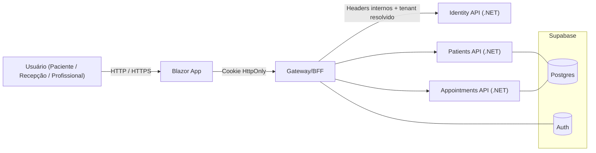
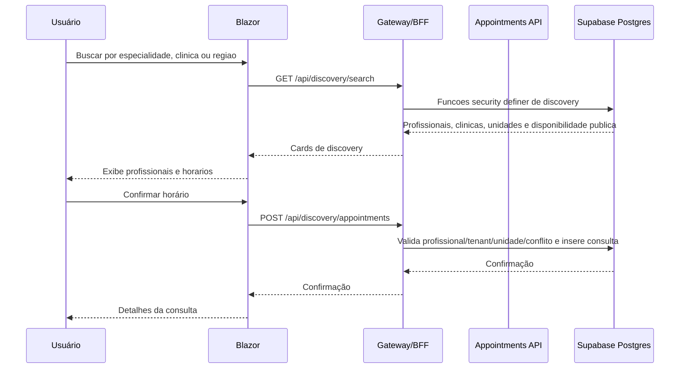
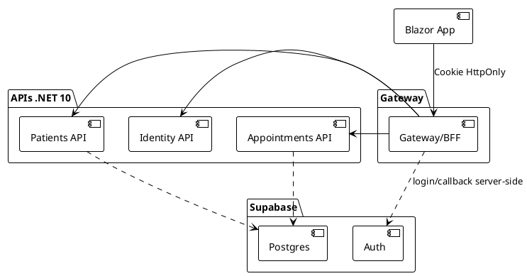
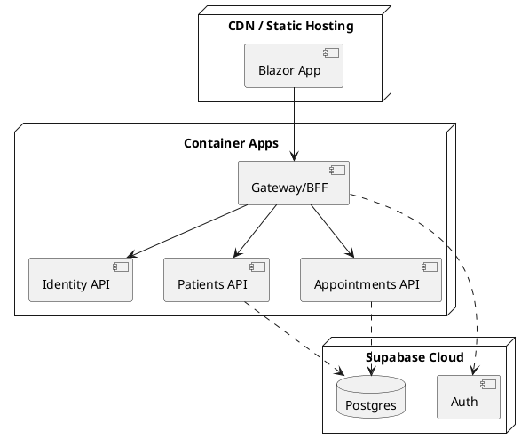
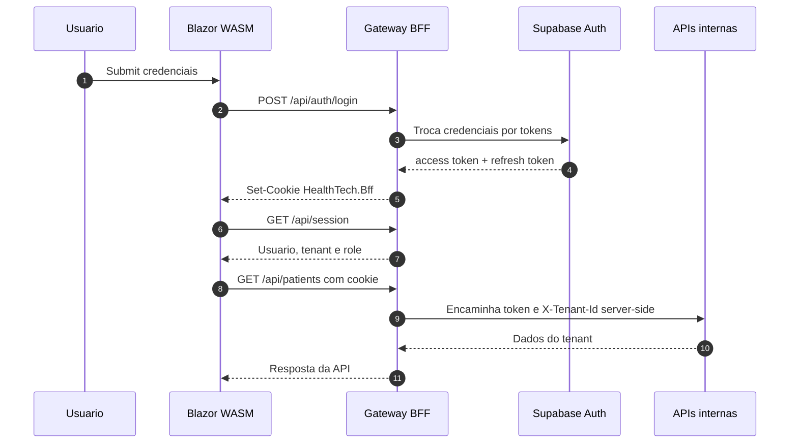

# HealthTech — Visão Geral do Projeto

Este documento resume o **core** do HealthTech: uma plataforma B2B para clínicas, consultórios e profissionais de saúde com módulos essenciais (agenda, cadastro de pacientes e profissionais, comunicação por WhatsApp, cadastro/validação de planos de saúde e discovery de profissionais por especialidade).

> Stack combinando **.NET 10 LTS** (backend), **Blazor** (frontend) e **Supabase Postgres** (DB + RLS + Auth server-side via BFF). Objetivo: lançar MVP rápido, escalável e com custo inicial baixo sem expor tokens sensíveis no browser.

## Documentacao principal

- [Documentacao detalhada do projeto](docs/project-documentation.md): arquitetura, SaaS multi-tenant, BFF, RBAC, endpoints, banco, frontend, operacao local e testes.
- [Notas de rearquitetura](docs/rearchitecture-implementation-notes.md): decisoes de seguranca, Supabase, Docker e validacao.
- [Operacao Supabase e OAuth](docs/supabase-oauth-operations.md): migrations, reconciliacao remota, Google OAuth e checklist de validacao.
- [Wireframes](doc/healthtech-wireframes.md): referencia visual das telas.

---

## Objetivos do MVP (primeira versão)

1. **Agenda unificada** (profissional/clinica): criação, cancelamento e remarcação; bloqueios; visualização diária/semanal.
2. **Cadastro simples**: pacientes, profissionais, convênios/planos, especialidades, locais de atendimento.
3. **Descoberta e marcação pública**: paciente busca por especialidade, profissional, clínica ou região, escolhe um card de profissional e reserva um horário disponível sem entrar no painel operacional.
4. **Comunicação**: disparo de confirmação/lembrete de consulta (WhatsApp) + status (confirmado, reagendado, faltou).
5. **Autenticação e autorização**: login BFF com cookie HttpOnly, OAuth server-side opcional e RBAC multi-tenant (`admin`, `professional`, `reception`, `billing`, `patient`) com `system_admin` global para operacao SaaS.

---

## Arquitetura (alto nível)

* **Frontend (Blazor .NET 10)**

  * Opções: **Blazor WebAssembly (WASM)** ou **Blazor Server**; para o MVP, considerar WASM hospedado com ASP.NET Core para melhor escalabilidade de leitura.
  * Roteamento com `<Router>` e componentes Razor; formulários com `EditForm` + validações por `DataAnnotations`.
  * Autenticação via **BFF no Gateway**: o browser usa cookie `HttpOnly`, `Secure`, `SameSite=Strict`; access/refresh tokens ficam no servidor.
  * `HttpClient` chama o BFF com credenciais de cookie; o BFF injeta tokens/tenant nas chamadas internas.
  * Páginas/áreas: Recepção, Profissional, Administração; `AuthorizeView` e `CascadingAuthenticationState` para RBAC.

* **Backend (.NET 10 / ASP.NET Minimal APIs)**

  * **Serviço de Identidade/BFF**: integra com Supabase Auth no servidor; emite cookie BFF e claims de domínio (papéis, tenant, plano).
  * **Serviço de Pacientes**: CRUD de pacientes, anotações básicas e preferências de contato.
  * **Serviço de Agenda**: slots, reservas, cancelamentos, no-shows, regras por profissional/local.
  * **Serviço de Convênios/Planos**: cadastro, tabelas, vínculo paciente→plano, validação prévia (mock inicialmente).
  * **Gateway/API Gateway** (ex.: YARP ou **BFF em ASP.NET Core**) para roteamento e simplificação dos endpoints ao frontend.

* **Dados**

  * **Supabase Postgres** como banco primário; schemas por domínio (identity, patients, scheduling, payers).
  * **Storage** (Supabase) para anexos (laudos/arquivos simples) fica para fase posterior; o MVP atual não chama Storage direto pelo browser.

* **Mensageria & Jobs (fase 2)**

  * Fila leve (Supabase Realtime ou Cloud Tasks/Queues gerenciada) p/ lembretes e webhooks do WhatsApp.

* **Observabilidade**

  * Logs estruturados (Serilog), métricas (Prometheus/OpenTelemetry), tracing básico entre serviços.

---

## Modelo de Dados (MVP — simplificado)

* **Patient**(id, name, birthDate, docId, phones[], email, planId?, notes)
* **Professional**(id, name, specialtyId, locations[])
* **Plan**(id, payer, name, externalCode?)
* **PatientPlan**(patientId, planId, status)
* **Appointment**(id, patientId, professionalId, locationId, startsAt, endsAt, status, notes)
* **User/Membership**(subjectId, email, role, professionalId?, tenantId) — provisionado a partir do BFF/Supabase Auth server-side via `core.tenant_user`
* **SystemAdminUser**(subjectId, email, active) — administrador global em `core.system_admin_user`
* **PatientIdentity**(tenantId, patientId, subjectId, email, active) — vinculo seguro entre login global e paciente da clinica

> Multi-tenant por **tenant_id** nas tabelas principais; enforcement por sessao resolvida no BFF, contexto interno nas APIs e RLS no Postgres.

---

## Fluxos Principais

1. **Descoberta e marcação pública**

   * Paciente busca **especialidade/profissional/clínica** + **cidade ou região** → vê cards públicos com profissionais, clínicas, unidades e horários → informa dados mínimos → o BFF cria a consulta por funções públicas controladas no Postgres.
2. **Lembrete via WhatsApp**

   * Job busca consultas de D-1 / H-3 → dispara mensagem → recebe webhook de resposta → atualiza status.
3. **Login e sessão**

   * BFF troca credenciais/callback com Supabase → emite cookie seguro → adiciona claims de domínio → autoriza rotas.
   * A tela de login separa **Clinica** de **Admin do Ambiente**. O acesso de clinica exige membership em `core.tenant_user`; o acesso de ambiente exige `core.system_admin_user` e entra sem tenant ativo obrigatorio.

---

## Segurança e Acesso

* O browser usa apenas cookie BFF `HttpOnly`; tokens Supabase não ficam em `localStorage` ou `sessionStorage`.
* Gateway resolve usuário/tenant/role pela sessão, rejeita `X-Tenant-Id` forjado e injeta headers internos server-side.
* **Row-Level Security** (RLS) no Postgres reforça isolamento multi-tenant.
* `system_admin` gerencia clinicas e administradores globais, mas nao acessa dados clinicos operacionais por padrao.
* Pacientes autenticados acessam o proprio contexto por `patients.patient_identity`, nao por IDs sensiveis enviados pelo browser.
* Rate limit no gateway p/ endpoints sensíveis.

---

## Roadmap (resumido)

* **M1 (MVP)**: Agenda + Pacientes + Autenticação + Descoberta por plano/especialidade + WhatsApp manual.
* **M2**: Lembretes automáticos, no-show handling, dashboards simples.
* **M3**: RLS, faturamento básico por convênio, integrações (ANS, operadoras), prontuário leve.

---

## Endpoints atuais pelo Gateway/BFF

* **GET /api/session** -> sessão BFF atual.
* **POST /api/session/tenant** -> troca a clinica ativa entre memberships do usuario.
* **POST /api/auth/login** -> login BFF; em desenvolvimento usa bootstrap local quando habilitado.
* **POST /api/auth/logout** -> encerra cookie BFF.
* **GET /api/discovery/clinics** -> lista publica de clinicas ativas para pacientes.
* **GET /api/discovery/search** -> busca publica por especialidade/profissional/clinica/regiao ou latitude/longitude, com cards e proximos horarios.
* **GET /api/discovery/specialties** -> especialidades publicas por clinica.
* **GET /api/discovery/professionals** -> profissionais publicos por clinica/especialidade.
* **GET /api/discovery/slots** -> horarios livres publicos por profissional e, opcionalmente, unidade.
* **POST /api/discovery/appointments** -> solicitacao publica de consulta com dados minimos do paciente e unidade opcional.
* **GET/POST /api/admin/clinics** e **PUT /api/admin/clinics/{tenantId}/status** -> gestao SaaS global e ativacao/desativacao de clinicas por `system_admin`.
* **GET/POST /api/admin/clinics/{tenantId}/admins** e **PUT /api/admin/clinics/{tenantId}/admins/{subjectId}** -> lista, cria e atualiza admins de clinica por `system_admin`.
* **GET/PUT /api/admin/system-users** -> gestao de `system_admin`.
* **GET/PUT /api/access/users** -> gestao de acessos da clinica ativa por `admin`.
* **GET/POST /api/patients** -> pacientes.
* **GET/POST /api/patients/plans** -> convênios/planos.
* **GET/POST /api/appointments** -> consultas.
* **GET /api/appointments/slots** -> slots disponíveis.
* **GET/POST /api/professionals**, **/api/specialties**, **/api/locations** -> base de agenda.
* **/api/appointments/{id}/whatsapp** e **/api/appointments/charges** -> WhatsApp manual e financeiro básico.

Detalhes do Discovery publico e comparativo com Doctoralia: [docs/discovery-doctoralia-spec.md](docs/discovery-doctoralia-spec.md).

---

## Diagramas (Mermaid)

### 1) Arquitetura (visão geral)



### 2) Sequência: Marcação de consulta



---

## Diagramas (PlantUML)

### 1) Componentes (backend + supabase)



### 2) Deploy (opcional / indicativo)



---

## Boas práticas e decisões

* **Custos**: Supabase (free tier p/ início), **CDN/Static Hosting** no front (Cloudflare Pages / Azure Static Web Apps / S3+CloudFront); backend em 1–2 containers compartilhados.
* **Monorepo** com workspaces (front/back/infrastructure) + CI simples (lint, build, tests) + deploy automatizado.
* **Qualidade**: testes de API (minimal), contratos via OpenAPI, validação com FluentValidation.
* **LGPD**: princípios de minimização de dados, logs sem PII, consentimentos explícitos.

---

## Próximos passos sugeridos

1. Conectar as migrations Supabase ao ambiente remoto e validar RLS com dois tenants reais.
2. Expandir a vertical para profissionais, locais e slots disponíveis com testes de concorrência.
3. Configurar Supabase OAuth no BFF (`Bff:SupabaseUrl`, `Bff:SupabaseAnonKey`, `Cors:AllowedOrigins`) e validar Google end-to-end.
4. Integrar **provedor de WhatsApp** (ex.: Z-API/Meta Cloud) com um único fluxo de lembrete.
5. Refinar telas de Recepção, Profissional e Admin com dados reais do BFF.

Para validação local de RLS/constraints em Postgres real, use um banco descartável com `HEALTHTECH_TEST_DATABASE`; o CI já sobe `postgres:16` e executa `tests/HealthTech.Database.Tests`.

## Docker Compose local

O projeto pode subir agrupado no Docker Desktop como um unico stack chamado `healthtech`.

1. Copie as variaveis de ambiente:

```powershell
Copy-Item .env.example .env
```

2. Suba o stack:

```powershell
docker compose up -d --build
```

URLs locais:

- Front: http://localhost:5191
- Gateway/BFF: http://localhost:5026
- Postgres: `localhost:55433`, database `healthtech`, usuario `postgres`, senha `postgres`

Para ativar Google real no ambiente local, preencha tambem no `.env`:

- `HEALTHTECH_SUPABASE_URL`
- `HEALTHTECH_SUPABASE_ANON_KEY`
- `HEALTHTECH_SUPABASE_AUTHORITY`
- `HEALTHTECH_SUPABASE_ISSUER`
- `HEALTHTECH_TENANT_ADMIN_EMAIL`
- `HEALTHTECH_SYSTEM_ADMIN_EMAIL`
- `HEALTHTECH_SYSTEM_ADMIN_SUBJECT_ID`
- `HEALTHTECH_OAUTH_PROVIDER_1=apple` se quiser expor Apple alem do Google

Use `HEALTHTECH_TENANT_ADMIN_EMAIL` para o admin da clinica demo e `HEALTHTECH_SYSTEM_ADMIN_EMAIL` para o primeiro Admin do Ambiente. O `db-migrate` grava esse primeiro admin em `core.system_admin_user`; depois disso a fonte de verdade continua sendo a tabela e a tela SaaS Admin. Quando estiver usando Google real, preencha esses valores com os e-mails que voltam do Supabase OAuth. `HEALTHTECH_SYSTEM_ADMIN_SUBJECT_ID` e opcional; se vazio, o seed usa o e-mail como identificador de bootstrap e a validacao tambem confere por e-mail.

Observacoes:

- `db-migrate` e um job one-shot: executa migrations + seed e finaliza com status `0`.
- APIs e frontend possuem healthcheck no Compose; valide com `docker compose ps`.
- O Gateway persiste chaves de DataProtection em volume Docker (`healthtech-gateway-dpkeys`) para manter cookies validos entre recreacoes.

Se existir container legado fora do stack (ex.: `healthtech-postgres-e2e`), remova:

```powershell
docker rm -f healthtech-postgres-e2e
```

Comandos uteis:

```powershell
docker compose ps
docker compose logs -f
docker compose stop
docker compose start
docker compose down
```

Reset completo do ambiente local (remove containers, rede e volumes do stack e sobe de novo):

```powershell
docker compose down -v
docker compose up -d --build
```

Atalhos equivalentes:

```powershell
.\scripts\healthtech-docker.ps1 up
.\scripts\healthtech-docker.ps1 pause
.\scripts\healthtech-docker.ps1 unpause
.\scripts\healthtech-docker.ps1 stop
.\scripts\healthtech-docker.ps1 start
.\scripts\healthtech-docker.ps1 logs
.\scripts\healthtech-docker.ps1 reset
```

Para apagar tambem o volume do banco local:

```powershell
docker compose down -v
```

Teste de integracao de banco com Postgres real local:

```powershell
$env:HEALTHTECH_TEST_DATABASE="Host=localhost;Port=55433;Database=healthtech_test;Username=postgres;Password=postgres;Include Error Detail=true"
dotnet test tests/HealthTech.Database.Tests/HealthTech.Database.Tests.csproj -c Release
```

Diferencas operacionais entre comandos:

- `docker compose stop`: para os containers, mantendo-os para `start` rapido.
- `docker compose pause`: congela processos dos containers sem encerramento.
- `docker compose down`: remove containers e rede do stack, preserva volumes.
- `docker compose down -v`: remove tambem volumes (zera dados persistidos locais).

Os containers, rede e volume usam nomes `healthtech-*`, e o `compose.yml` define `name: healthtech` para aparecer agrupado no Docker Desktop.

---

## Autenticação BFF — Estado Atual

O frontend não persiste tokens Supabase no browser. O Front chama o Gateway/BFF com cookies incluídos, e o Gateway emite um cookie `HealthTech.Bff` com `HttpOnly`, `Secure` e `SameSite=Strict`.

Endpoints principais:

* `GET /api/session` — retorna sessão atual ou anônimo.
* `GET /api/auth/providers` — informa se OAuth server-side está configurado e quais provedores podem aparecer no frontend.
* `POST /api/auth/login` — autentica no BFF; em desenvolvimento pode usar bootstrap local.
* `GET /api/auth/login/{provider}` — inicia OAuth server-side com PKCE e cookie temporário de correlação.
* `GET /api/auth/callback` — valida state/correlação, troca o code no Supabase pelo BFF e emite a sessão segura.
* `POST /api/auth/logout` — encerra o cookie BFF.
* `GET/POST /api/patients` e `/api/appointments` — passam pelo Gateway e usam tenant resolvido pela sessão.



Segredos devem ficar em `user-secrets`, variáveis de ambiente ou secrets do CI. A senha Supabase removida do repositório precisa ser rotacionada no provedor.

Checklist de Google OAuth real no Supabase:

1. Ative o provider Google no projeto Supabase.
2. Cadastre `http://localhost:5191/auth/callback` como redirect URL permitida.
3. Preencha no `.env` o `HEALTHTECH_SUPABASE_URL`, `HEALTHTECH_SUPABASE_ANON_KEY`, `HEALTHTECH_SUPABASE_AUTHORITY`, `HEALTHTECH_SUPABASE_ISSUER`, `HEALTHTECH_TENANT_ADMIN_EMAIL` e `HEALTHTECH_SYSTEM_ADMIN_EMAIL`.
4. Se quiser Apple tambem, configure o provider Apple no Supabase e adicione `HEALTHTECH_OAUTH_PROVIDER_1=apple`.
5. Se quiser forcar apenas login real, troque `HEALTHTECH_BFF_ENABLE_DEV_AUTH` para `false`.
