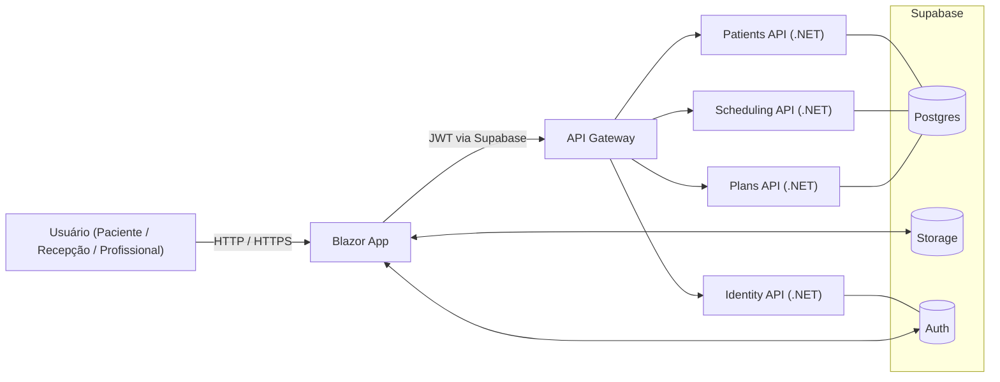
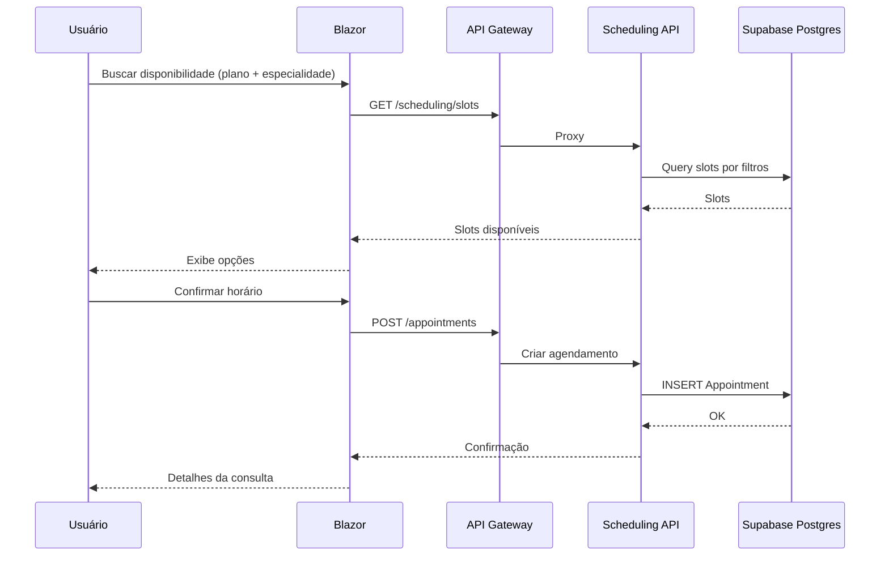
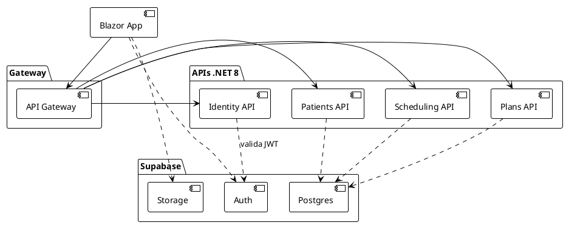
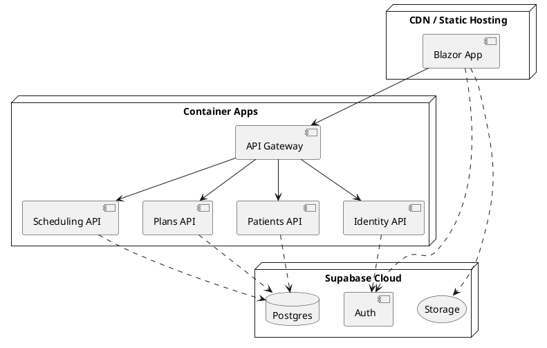
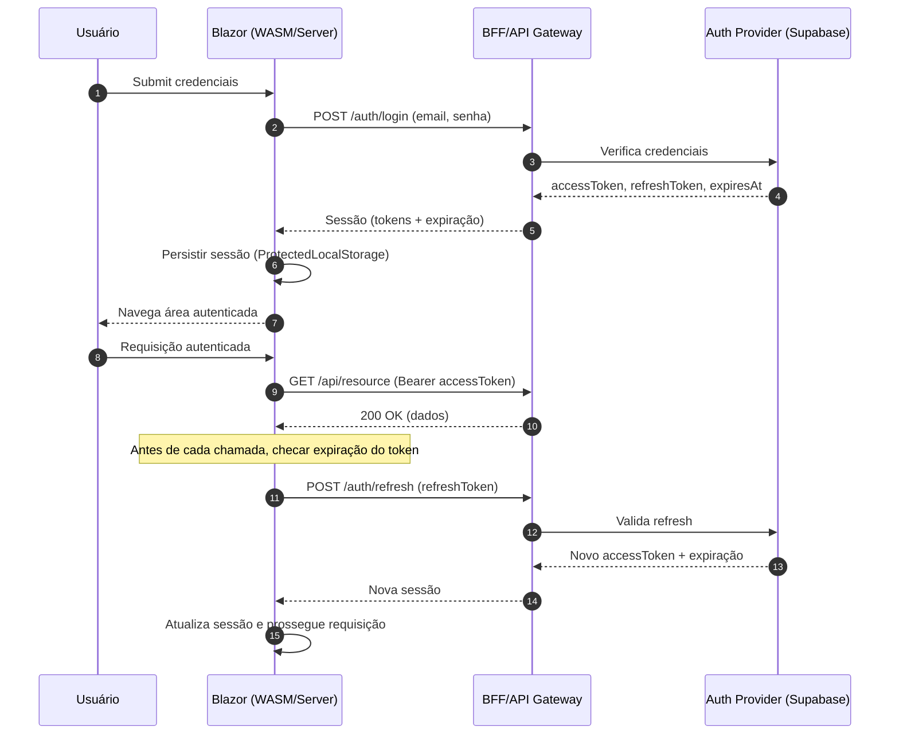

# HealthTech — Visão Geral do Projeto

Este documento resume o **core** do HealthTech: uma plataforma B2B para clínicas, consultórios e profissionais de saúde com módulos essenciais (agenda, cadastro de pacientes e profissionais, comunicação por WhatsApp, cadastro/validação de planos de saúde e discovery de profissionais por especialidade).

> Stack combinando **.NET 8** (backend), **Blazor** (frontend) e **Supabase** (Auth + DB + Storage + Realtime). Objetivo: lançar MVP rápido, escalável e com custo inicial baixo.

---

## Objetivos do MVP (primeira versão)

1. **Agenda unificada** (profissional/clinica): criação, cancelamento e remarcação; bloqueios; visualização diária/semanal.
2. **Cadastro simples**: pacientes, profissionais, convênios/planos, especialidades, locais de atendimento.
3. **Descoberta**: paciente informa plano e especialidade e vê profissionais disponíveis (com filtros básicos).
4. **Comunicação**: disparo de confirmação/lembrete de consulta (WhatsApp) + status (confirmado, reagendado, faltou).
5. **Autenticação e autorização**: login (e-mail/senha, opcionalmente OAuth) e RBAC básico (admin, prof, recepção).

---

## Arquitetura (alto nível)

* **Frontend (Blazor .NET 8)**

  * Opções: **Blazor WebAssembly (WASM)** ou **Blazor Server**; para o MVP, considerar WASM hospedado com ASP.NET Core para melhor escalabilidade de leitura.
  * Roteamento com `<Router>` e componentes Razor; formulários com `EditForm` + validações por `DataAnnotations`.
  * Autenticação via **Supabase Auth** usando **supabase-csharp** (validação e refresh de JWT) com armazenamento seguro (`ProtectedLocalStorage`).
  * `HttpClient` com `AuthorizationMessageHandler` para anexar o token automaticamente às chamadas das APIs.
  * Páginas/áreas: Recepção, Profissional, Administração; `AuthorizeView` e `CascadingAuthenticationState` para RBAC.

* **Backend (.NET 8 / ASP.NET Minimal APIs)** (.NET 8 / ASP.NET Minimal APIs)**

  * **Serviço de Identidade**: integra com Supabase Auth (validação de JWT); emite claims de domínio (papéis, tenant, plano).
  * **Serviço de Pacientes**: CRUD de pacientes, anotações básicas e preferências de contato.
  * **Serviço de Agenda**: slots, reservas, cancelamentos, no-shows, regras por profissional/local.
  * **Serviço de Convênios/Planos**: cadastro, tabelas, vínculo paciente→plano, validação prévia (mock inicialmente).
  * **Gateway/API Gateway** (ex.: YARP ou **BFF em ASP.NET Core**) para roteamento e simplificação dos endpoints ao frontend.

* **Dados**

  * **Supabase Postgres** como banco primário; schemas por domínio (identity, patients, scheduling, payers).
  * **Storage** (Supabase) para anexos (laudos/arquivos simples) — no MVP: limite de tipos e tamanho.

* **Mensageria & Jobs (fase 2)**

  * Fila leve (Supabase Realtime ou Cloud Tasks/Queues gerenciada) p/ lembretes e webhooks do WhatsApp.

* **Observabilidade**

  * Logs estruturados (Serilog), métricas (Prometheus/OpenTelemetry), tracing básico entre serviços.

---

## Modelo de Dados (MVP — simplificado)

* **Patient**(id, name, birthDate, docId, phones[], email, planId?, notes)
* **Professional**(id, name, specialtyId, locations[])
* **Plan**(id, payer, name, externalCode?)
* **PatientPlan**(patientId, planId, status)
* **Appointment**(id, patientId, professionalId, locationId, startsAt, endsAt, status, notes)
* **User**(id, email, role, professionalId?, clinicId?) — provisionado a partir do Supabase Auth

> Multi‑tenant simples por **clinicId** em tabelas principais; enforcement por claim + filtros em todas as queries.

---

## Fluxos Principais

1. **Descoberta e marcação**

   * Paciente informa **plano** + **especialidade** → lista de **profissionais disponíveis** (slots livres) → cria Appointment.
2. **Lembrete via WhatsApp**

   * Job busca consultas de D-1 / H-3 → dispara mensagem → recebe webhook de resposta → atualiza status.
3. **Login e sessão**

   * Supabase Auth emite JWT → .NET valida (chave pública) → adiciona claims de domínio → autoriza rotas.

---

## Segurança e Acesso

* JWT do Supabase validado no gateway/serviços; **políticas** por role (admin, prof, recepção).
* **Row-Level Security** (RLS) no Postgres (fase 2) para reforço de multi-tenant.
* Rate limit no gateway p/ endpoints sensíveis.

---

## Roadmap (resumido)

* **M1 (MVP)**: Agenda + Pacientes + Autenticação + Descoberta por plano/especialidade + WhatsApp manual.
* **M2**: Lembretes automáticos, no-show handling, dashboards simples.
* **M3**: RLS, faturamento básico por convênio, integrações (ANS, operadoras), prontuário leve.

---

## Endpoints (rascunho)

* **/auth/me** → perfil e claims
* **/patients** → CRUD
* **/scheduling/slots?professionalId&from&to** → listar slots
* **/appointments** → criar/cancelar/listar
* **/plans** → CRUD e vínculo paciente‑plano

---

## Diagramas (Mermaid)

### 1) Arquitetura (visão geral)



### 2) Sequência: Marcação de consulta



---

## Diagramas (PlantUML)

### 1) Componentes (backend + supabase)



### 2) Deploy (opcional / indicativo)



---

## Boas práticas e decisões

* **Custos**: Supabase (free tier p/ início), **CDN/Static Hosting** no front (Cloudflare Pages / Azure Static Web Apps / S3+CloudFront); backend em 1–2 containers compartilhados.
* **Monorepo** com workspaces (front/back/infrastructure) + CI simples (lint, build, tests) + deploy automatizado.
* **Qualidade**: testes de API (minimal), contratos via OpenAPI, validação com FluentValidation.
* **LGPD**: princípios de minimização de dados, logs sem PII, consentimentos explícitos.

---

## Próximos passos sugeridos

1. Definir **esquema inicial** no Postgres (migrations) e seed de especialidades/planos.
2. Entregar **/patients** e **/scheduling/slots** com integração real ao DB.
3. Implementar **autenticação** no Blazor: `AuthenticationStateProvider` + `AuthorizeView` e `AuthorizationMessageHandler` no `HttpClient` para anexar o JWT do Supabase às requisições.
4. Integrar **provedor de WhatsApp** (ex.: Z-API/Meta Cloud) com um único fluxo de lembrete.
5. Esboçar telas no Figma e alinhar navegação (Recepção, Profissional, Admin).

---

## Autenticação no Blazor — Exemplo de Arquitetura

### Objetivo

* Armazenar a sessão (JWT + refresh token) com segurança.
* Injetar `Authorization: Bearer <token>` automaticamente no `HttpClient`.
* Renovar o token quando próximo de expirar (refresh) sem interromper a navegação.
* Expor `ClaimsPrincipal` via `AuthenticationStateProvider` para `AuthorizeView`/`[Authorize]`.

### Registro de serviços (Program.cs)

```csharp
var builder = WebApplication.CreateBuilder(args);

// HttpClient base para BFF/APIs
builder.Services.AddHttpClient("Api", client =>
{
    client.BaseAddress = new Uri(builder.Configuration["ApiBaseUrl"]!);
});

// Handler que injeta o Bearer e tenta refresh transparente
builder.Services.AddTransient<AuthTokenHandler>();

builder.Services.AddHttpClient("Api.Authenticated", client =>
{
    client.BaseAddress = new Uri(builder.Configuration["ApiBaseUrl"]!);
})
.AddHttpMessageHandler<AuthTokenHandler>();

// Auth state
builder.Services.AddScoped<AuthenticationStateProvider, SupabaseAuthStateProvider>();
builder.Services.AddAuthorizationCore(options =>
{
    options.AddPolicy("ReceptionOnly", p => p.RequireRole("reception"));
});

// Storage protegido para tokens
builder.Services.AddScoped<ProtectedLocalStorage>();

var app = builder.Build();
app.Run();
```

### AuthenticationStateProvider (simplificado)

```csharp
public class SupabaseAuthStateProvider : AuthenticationStateProvider
{
    private readonly ProtectedLocalStorage _storage;
    private const string SessionKey = "auth_session"; // { accessToken, refreshToken, expiresAt }

    public SupabaseAuthStateProvider(ProtectedLocalStorage storage)
    {
        _storage = storage;
    }

    public override async Task<AuthenticationState> GetAuthenticationStateAsync()
    {
        var session = await ReadSessionAsync();
        if (session is null || session.IsExpired)
            return new AuthenticationState(new ClaimsPrincipal(new ClaimsIdentity()));

        var identity = new ClaimsIdentity(ParseClaims(session.AccessToken), authType: "jwt");
        return new AuthenticationState(new ClaimsPrincipal(identity));
    }

    public async Task SignInAsync(AuthSession session)
    {
        await _storage.SetAsync(SessionKey, session);
        NotifyAuthenticationStateChanged(GetAuthenticationStateAsync());
    }

    public async Task SignOutAsync()
    {
        await _storage.DeleteAsync(SessionKey);
        NotifyAuthenticationStateChanged(GetAuthenticationStateAsync());
    }

    public async Task<AuthSession?> ReadSessionAsync()
    {
        var result = await _storage.GetAsync<AuthSession>(SessionKey);
        return result.Success ? result.Value : null;
    }

    private static IEnumerable<Claim> ParseClaims(string jwt)
    {
        // decodifica payload (base64url) e projeta para Claims; omisso por brevidade
        return new List<Claim>();
    }
}

public record AuthSession(string AccessToken, string RefreshToken, DateTimeOffset ExpiresAt)
{
    public bool IsExpired => DateTimeOffset.UtcNow.AddMinutes(1) >= ExpiresAt; // margem de segurança
}
```

### HttpMessageHandler com refresh

```csharp
public class AuthTokenHandler : DelegatingHandler
{
    private readonly SupabaseAuthStateProvider _auth;
    private readonly IServiceProvider _sp;

    public AuthTokenHandler(SupabaseAuthStateProvider auth, IServiceProvider sp)
    {
        _auth = auth; _sp = sp;
    }

    protected override async Task<HttpResponseMessage> SendAsync(HttpRequestMessage request, CancellationToken ct)
    {
        var session = await _auth.ReadSessionAsync();
        if (session is null)
            return await base.SendAsync(request, ct);

        // tenta refresh se vencido/próximo
        if (session.IsExpired)
        {
            var refreshed = await TryRefreshAsync(session, ct);
            if (refreshed is not null) session = refreshed; else await _auth.SignOutAsync();
        }

        if (session is not null)
            request.Headers.Authorization = new AuthenticationHeaderValue("Bearer", session.AccessToken);

        var response = await base.SendAsync(request, ct);

        if (response.StatusCode == HttpStatusCode.Unauthorized)
        {
            // uma última tentativa de refresh reativa
            var refreshed = await TryRefreshAsync(session!, ct);
            if (refreshed is not null)
            {
                request.Headers.Authorization = new AuthenticationHeaderValue("Bearer", refreshed.AccessToken);
                response.Dispose();
                return await base.SendAsync(request, ct);
            }
        }

        return response;
    }

    private async Task<AuthSession?> TryRefreshAsync(AuthSession session, CancellationToken ct)
    {
        // Chame seu endpoint de refresh do BFF ou a API do provedor (ex.: Supabase Auth) aqui.
        // Supondo um BFF: POST /auth/refresh { refreshToken }
        var client = _sp.GetRequiredService<IHttpClientFactory>().CreateClient("Api");
        var res = await client.PostAsJsonAsync("/auth/refresh", new { refreshToken = session.RefreshToken }, ct);
        if (!res.IsSuccessStatusCode) return null;
        var payload = await res.Content.ReadFromJsonAsync<AuthSession>(cancellationToken: ct);
        if (payload is null) return null;
        await _sp.GetRequiredService<SupabaseAuthStateProvider>().SignInAsync(payload);
        return payload;
    }
}
```

### Login/Logout (exemplo de página)

```razor
@page "/login"
@inject SupabaseAuthStateProvider Auth
@inject NavigationManager Nav

<EditForm Model="login" OnValidSubmit="HandleLogin">
  <!-- campos de e-mail/senha -->
  <button type="submit">Entrar</button>
</EditForm>

@code {
  private LoginModel login = new();

  private async Task HandleLogin()
  {
    // Chame seu BFF: /auth/login -> retorna { accessToken, refreshToken, expiresAt }
    var session = await DoLoginAsync(login.Email, login.Password);
    await Auth.SignInAsync(session);
    Nav.NavigateTo("/");
  }
}
```

---

## Diagrama (Mermaid) — Fluxo de Login e Refresh



### Observações

* **BFF /auth/login** e **/auth/refresh** simplificam a lógica no cliente e evitam expor chaves do provedor.
* Guarde apenas o necessário (mínimo de dados pessoais) no storage e use **HTTPS** sempre.
* Considere invalidar refresh tokens no servidor ao fazer logout e rotação periódica de chaves.
