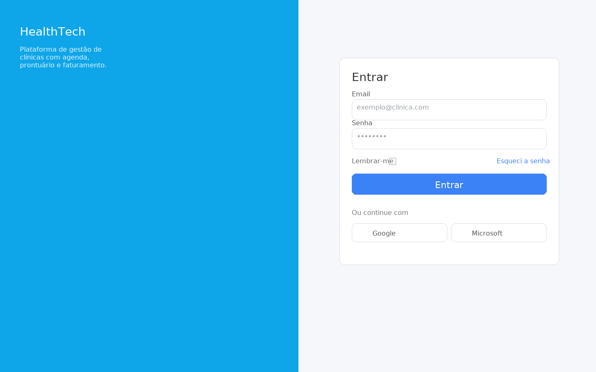
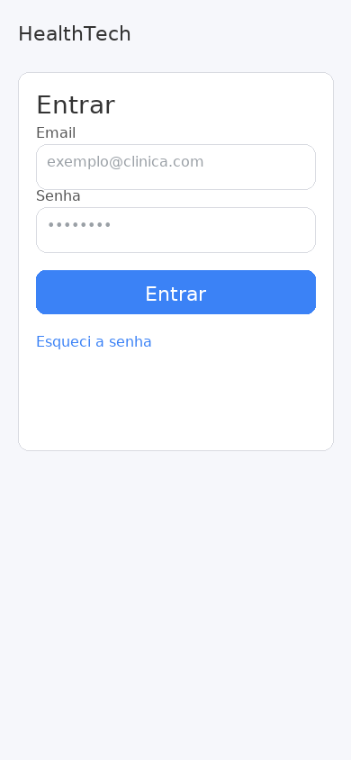
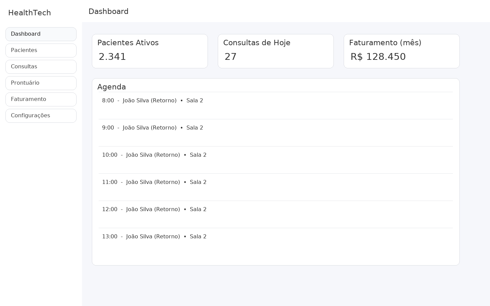
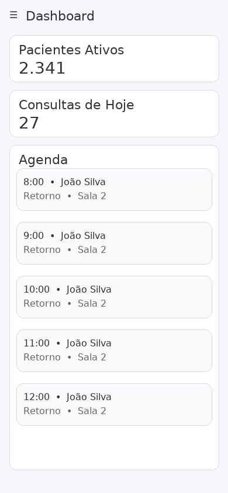

# HealthTech — Wireframes (UI Reais)

_Gerado em 2025-10-05 20:47._

> Este documento contém os **wireframes visuais** (desktop e mobile) para os módulos **Login** e **Dashboard**, além de instruções de navegação.

## 1. Login

### Desktop

### Mobile

## 2. Dashboard

### Desktop

### Mobile

---

## Notas de UI
- Layout baseado em **Blazor + MudBlazor** (cards, sidebar, topbar).
- Paleta neutra para wireframe (cores de referência).

