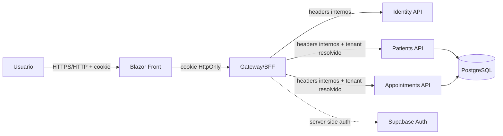

# HealthTech - Documentacao detalhada do projeto

## 1. Visao geral

HealthTech e uma plataforma SaaS B2B para gestao de clinicas, consultorios e operacoes de saude. O produto centraliza agenda, pacientes, profissionais, convenios, prontuario leve, comunicacao por WhatsApp e financeiro basico, com isolamento multi-tenant por clinica.

O projeto usa:

- C# e .NET 10.
- ASP.NET Core Minimal APIs.
- Blazor WebAssembly para o Front.
- Supabase/PostgreSQL como banco primario.
- SQL versionado em `supabase/migrations`.
- Docker Compose para runtime local.
- xUnit para testes de gateway, aplicacao, frontend clients e banco.

O browser nao conversa diretamente com Supabase Auth nem recebe tokens sensiveis. A sessao do usuario e resolvida pelo Gateway/BFF e mantida por cookie HttpOnly.

## 2. Objetivos funcionais

O MVP cobre:

- Cadastro e consulta de pacientes.
- Cadastro e consulta de convenios e vinculo paciente-convenio.
- Cadastro de profissionais, especialidades e locais de atendimento.
- Criacao, listagem e cancelamento de consultas.
- Consulta de slots disponiveis.
- Discovery publico para pacientes marcarem consulta por especialidade, profissional, clinica, cidade/regiao e horario livre.
- Registro manual de intencoes e status de mensagens WhatsApp.
- Prontuario leve por evolucoes de paciente.
- Financeiro basico por cobrancas e lotes.
- Gestao de acessos por clinica.
- Administracao SaaS global para criacao de clinicas e admins iniciais.

## 3. Organizacao do repositorio

```text
src/
  apphost/                         Aspire/AppHost local
  shared/
    Abstractions/                  contratos compartilhados, contexto e RBAC
    SharedKernel/                  base para tipos compartilhados
  bff/                             Gateway/BFF, auth, sessao e proxy
  apis/
    Identity/                      API de identidade/whoami
    Patients/                      dominio, aplicacao, infra e API de pacientes
    Appointments/                  agenda, profissionais, financeiro e WhatsApp
  front/
    Features/                      componentes de discovery, pacientes, agenda, prontuario e financeiro
    DesignSystem/                  componentes e showcase visual
    Pages/                         rotas do Blazor WASM

supabase/
  migrations/                      schema, RLS, funcoes e grants
  seed.sql                         seed demo idempotente

tests/
  HealthTech.Gateway.Tests/
  HealthTech.Patients.Tests/
  HealthTech.Appointments.Tests/
  HealthTech.Database.Tests/
  HealthTech.FrontendClients.Tests/
```

## 4. Arquitetura de runtime

O runtime local e composto por Front, Gateway/BFF, APIs internas e PostgreSQL.



Responsabilidades principais:

- Front: experiencia de usuario, leitura de sessao e renderizacao condicional por permissoes ja retornadas pelo BFF.
- Gateway/BFF: autenticacao, cookie, resolucao de tenant ativo, resolucao de permissoes, endpoints SaaS globais, discovery publico controlado e roteamento para APIs internas.
- APIs internas: regras de aplicacao e persistencia por dominio.
- PostgreSQL: fonte de verdade de dados, isolamento multi-tenant, RLS e funcoes administrativas.

## 5. Padrao arquitetural

O projeto segue uma separacao pratica inspirada em Clean Architecture:

- `Domain`: entidades e conceitos de negocio do modulo.
- `Application`: handlers, comandos, consultas, autorizacao de caso de uso e Result pattern.
- `Infrastructure`: acesso a banco via Npgsql e implementacoes de repositorio.
- `Api`: Minimal APIs e contratos HTTP do modulo.
- `Gateway`: BFF e politicas de borda.
- `BuildingBlocks`: contratos compartilhados entre modulos.

As APIs internas nao devem confiar em `tenant_id`, `patient_id`, `professional_id` ou role enviados pelo frontend como autoridade final. O contexto confiavel vem de `IRequestContextAccessor`, preenchido pelo pipeline interno e pelos headers gerados pelo Gateway.

## 6. Autenticacao e sessao

O Gateway/BFF centraliza autenticacao.

Fluxos disponiveis:

- Login local/dev por `POST /api/auth/login` quando `Bff:EnableDevAuth` esta habilitado.
- OAuth server-side via Supabase por `GET /api/auth/login/{provider}` e `GET /api/auth/callback`.
- Logout por `POST /api/auth/logout`.
- Consulta de capacidades por `GET /api/auth/providers`.
- Consulta de sessao por `GET /api/session`.
- Troca de clinica ativa por `POST /api/session/tenant`.

A tela de login possui duas entradas explicitas:

- **Clinica**: envia `accessArea = "clinic"` e o BFF so emite sessao quando o usuario possui membership ativo em `core.tenant_user`.
- **Admin do Ambiente**: envia `accessArea = "environment"` e o BFF so emite sessao quando `core.is_system_admin(subject_id, email)` retorna verdadeiro. Nesse modo o BFF nao seleciona tenant automaticamente e redireciona para `/saas-admin`.

O cookie principal e `HealthTech.Bff`, configurado como HttpOnly, Secure e SameSite Strict. Tokens Supabase permanecem no servidor.

A resposta de sessao contem:

```json
{
  "authenticated": true,
  "user": { "id": "subject-id", "email": "user@example.com" },
  "activeTenant": {
    "id": "tenant-guid",
    "name": "Clinica Exemplo",
    "role": "admin",
    "permissions": ["ManagePatients", "ManageSchedule"]
  },
  "memberships": [
    {
      "id": "tenant-guid",
      "name": "Clinica Exemplo",
      "role": "admin",
      "permissions": ["ManagePatients", "ManageSchedule"]
    }
  ],
  "requiresOnboarding": false,
  "isSystemAdmin": false,
  "globalPermissions": []
}
```

Para `system_admin`, `activeTenant` nao e obrigatorio. As permissoes globais sao retornadas em `globalPermissions`.

## 7. Modelo SaaS multi-tenant

No banco, clinica corresponde a `core.tenant`. A associacao de usuarios a uma clinica fica em `core.tenant_user`.

Tabelas centrais:

- `core.tenant`: clinicas/tenants.
- `core.tenant_user`: usuarios, papeis e status por clinica.
- `core.system_admin_user`: administradores globais do SaaS.
- `patients.patient`: cadastro clinico do paciente dentro de um tenant.
- `patients.patient_identity`: vinculo entre identidade autenticada global e paciente especifico dentro de uma clinica.
- `scheduling.professional`, `scheduling.specialty`, `scheduling.location`: base operacional de agenda.
- `appointments.appointment`: consultas.
- `appointments.whatsapp_manual_message`: mensagens WhatsApp manuais.
- `appointments.charge` e `appointments.billing_batch`: financeiro basico.

`patients.patient_identity` permite que o mesmo login de paciente exista em mais de uma clinica sem expor dados entre tenants.

## 8. Controle de acesso

As regras de permissao ficam centralizadas em `ClinicAuthorization`.

Papel global:

| Papel | Escopo | Permissoes |
| --- | --- | --- |
| `system_admin` | SaaS global | `ManageClinics`, `ManageSystemAdmins` |

Papeis por clinica:

| Papel | Escopo | Permissoes principais |
| --- | --- | --- |
| `admin` | Clinica ativa | todas as permissoes da clinica |
| `professional` | profissional vinculado | pacientes atendidos, agenda propria e prontuario permitido |
| `reception` | clinica ativa | pacientes, convenios, agenda e leitura de contexto de cobranca |
| `billing` | clinica ativa | financeiro e leitura operacional sem escrita clinica |
| `patient` | identidade de paciente | proprio perfil e proprios agendamentos |

Permissoes por clinica:

- `ManageAccess`
- `ManagePatients`
- `ReadPatients`
- `ReadBillingContext`
- `ManageSchedule`
- `ReadOwnClinicalSchedule`
- `ReadClinicalRecord`
- `WriteClinicalRecord`
- `ManageBilling`
- `ManageProfessionals`
- `ReadOwnPatientProfile`
- `ManageOwnAppointments`

Regras importantes:

- `system_admin` nao recebe acesso automatico aos dados clinicos operacionais.
- `admin` de uma clinica nao pode alterar usuarios de outra clinica.
- `professional` fica restrito ao proprio contexto profissional quando aplicavel.
- `patient` nao pode listar todos os pacientes da clinica.
- Handlers de paciente autenticado resolvem o paciente real por `patients.patient_identity`, ignorando IDs forjados pelo browser quando o fluxo exige escopo proprio.

## 9. Banco, schemas e RLS

Schemas principais:

- `core`
- `patients`
- `scheduling`
- `appointments`

As migrations aplicam `FORCE ROW LEVEL SECURITY` nas tabelas tenant-scoped. A role de aplicacao deve usar privilegios minimos e `NOBYPASSRLS`.

Isolamento de tenant:

- As queries usam o contexto confiavel do servidor.
- O banco usa politicas baseadas no tenant corrente.
- Headers como `X-Tenant-Id` vindos do browser sao rejeitados como autoridade.
- O Gateway injeta headers internos apenas em chamadas server-to-server.

Funcoes administrativas relevantes:

- `core.is_system_admin(subject_id, email)`
- `core.resolve_tenant_memberships(subject_id, email)`
- `patients.resolve_patient_identity(tenant_id, subject_id, email)`
- `core.admin_list_tenants(subject_id, email)`
- `core.admin_create_tenant(subject_id, email, name, admin_subject_id, admin_email)`
- `core.admin_upsert_tenant_admin(subject_id, email, tenant_id, admin_subject_id, admin_email, full_name, phone)`
- `core.admin_list_system_admins(subject_id, email)`
- `core.admin_upsert_system_admin(subject_id, email, target_subject_id, target_email, active)`

## 10. Gateway/BFF

O Gateway expõe a superficie consumida pelo Front e protege as APIs internas.

Endpoints de sessao e auth:

- `GET /api/session`
- `POST /api/session/tenant`
- `GET /api/auth/providers`
- `POST /api/auth/login`
- `POST /api/auth/register`
- `POST /api/auth/password/recovery`
- `GET /api/auth/login/{provider}`
- `GET /api/auth/callback`
- `POST /api/auth/logout`

Onboarding:

- `POST /api/onboarding`
- A criacao publica de clinica fica desativada por padrao.
- Quando `Bff:EnablePublicOnboarding` nao estiver explicitamente habilitado, o endpoint retorna `403`.

Administracao SaaS global:

- `GET /api/admin/clinics`
- `POST /api/admin/clinics`
- `POST /api/admin/clinics/{tenantId}/admins`
- `GET /api/admin/system-users`
- `PUT /api/admin/system-users/{subjectId}`

Discovery publico para pacientes:

- `GET /api/discovery/search?mode=professional|clinic&query={texto}&clinic={clinica}&specialty={especialidade}&region={regiao}&latitude={lat}&longitude={lng}&take=20`
- `GET /api/discovery/clinics`
- `GET /api/discovery/specialties?tenantId={tenantId}`
- `GET /api/discovery/professionals?tenantId={tenantId}&specialtyId={specialtyId?}`
- `GET /api/discovery/slots?tenantId={tenantId}&professionalId={professionalId}&locationId={locationId?}&fromUtc={fromUtc}&toUtc={toUtc}&slotMinutes=30`
- `POST /api/discovery/appointments`

Esse fluxo e anonimo, mas nao reutiliza as APIs operacionais protegidas. O BFF chama funcoes `security definer` especificas de discovery no Postgres, que so retornam clinicas/profissionais ativos e validam conflito de horario no banco antes de inserir a consulta.

Quando `latitude` e `longitude` sao informadas juntas, a busca publica ordena unidades georreferenciadas por proximidade aproximada. A permissao de localizacao do navegador so e solicitada por acao explicita do paciente no front.

Especificacao de produto e comparativo com a referencia Doctoralia: `docs/discovery-doctoralia-spec.md`.

Contrato de marcacao publica:

- O browser envia apenas IDs tecnicos necessarios (`tenantId`, `professionalId`, `locationId` opcional), janela escolhida e dados minimos do paciente.
- IDs sao contrato interno entre Front e BFF; a UI publica sempre mostra nomes de clinica, profissional, especialidade, unidade e regiao.
- O BFF valida formato, duracao e intervalo antes de acessar o banco.
- O banco confirma que a clinica, profissional e unidade opcional estao ativos e pertencem ao mesmo tenant.
- Conflitos de horario sao bloqueados dentro da funcao `appointments.discovery_book_appointment`.
- O fluxo anonimo nao expoe listagem de pacientes, prontuario, financeiro ou endpoints operacionais tenant-scoped.

Gestao de acessos por clinica:

- `GET /api/access/users`
- `PUT /api/access/users/{subjectId}`

Proxy tenant-scoped:

- `/api/patients`
- `/api/appointments`
- `/api/professionals`
- `/api/specialties`
- `/api/locations`

## 11. APIs de dominio

Patients API:

- `POST /api/patients`
- `GET /api/patients`
- `GET /api/patients/{patientId}`
- `POST /api/patients/plans`
- `GET /api/patients/plans`
- `PUT /api/patients/{patientId}/plans/{planId}`
- `GET /api/patients/{patientId}/plans`
- `POST /api/patients/{patientId}/evolutions`
- `GET /api/patients/{patientId}/evolutions`

Appointments API:

- `POST /api/appointments`
- `GET /api/appointments`
- `GET /api/appointments/slots`
- `POST /api/appointments/{appointmentId}/cancel`
- `POST /api/appointments/{appointmentId}/whatsapp/intents`
- `POST /api/appointments/{appointmentId}/whatsapp/{messageId}/sent`
- `GET /api/appointments/{appointmentId}/whatsapp`
- `POST /api/appointments/charges`
- `GET /api/appointments/charges`
- `POST /api/appointments/charges/{chargeId}/paid`
- `POST /api/appointments/batches/close`
- `GET /api/appointments/batches`
- `GET /api/professionals`
- `POST /api/professionals`
- `GET /api/specialties`
- `POST /api/specialties`
- `GET /api/locations`
- `POST /api/locations`

Identity API:

- `GET /health`
- endpoints de identidade publica/interna usados pelo Gateway.

## 12. Frontend Blazor

O front unico fica em `src/front`.

Paginas principais:

- `Home.razor`: para visitantes, discovery de clinicas/especialidades/profissionais e marcacao de consulta; para usuarios autenticados, visao operacional da clinica ativa.
- `Login.razor`: entrada por credenciais ou provider configurado.
- `Register.razor`: cadastro de autenticacao quando habilitado.
- `AuthCallback.razor`: retorno OAuth.
- `Onboarding.razor`: tela historica de onboarding, hoje bloqueada quando criacao publica esta desativada.
- `Pacientes.razor`: cadastro e consulta de pacientes.
- `Consultas.razor`: agenda e consultas.
- `Profissionais.razor`: profissionais, especialidades e locais.
- `Prontuario.razor`: evolucoes do paciente.
- `Financeiro.razor`: cobrancas e lotes.
- `Acessos.razor`: usuarios e papeis por clinica.
- `MinhasClinicas.razor`: area autenticada para listar vinculos e trocar a clinica ativa.
- `SaasAdmin.razor`: administracao global de clinicas e system admins.

O frontend usa `BffAuthService` para:

- carregar a sessao;
- trocar o tenant ativo;
- consultar permissoes;
- chamar endpoints de auth, acessos e SaaS admin;
- renderizar menus conforme permissoes retornadas pelo BFF.

A regra sensivel nao deve ser duplicada como fonte de verdade no frontend. A UI apenas oculta ou bloqueia fluxos conforme a sessao retornada pelo BFF; o backend continua decidindo autorizacao.

O discovery publico usa `DiscoveryBffClient` e `Features/Discovery/DiscoveryBooking.razor`. Ele fica na primeira tela para visitantes e consome somente `/api/discovery/*`, mantendo a experiencia de marcacao separada do painel autenticado da clinica. O topbar publico expõe **Area da clinica** para `/login?accessArea=clinic`; usuarios autenticados acessam `/minhas-clinicas` para entrar no workspace correto.

## 13. Configuracao local

Crie o `.env` a partir do exemplo:

```powershell
Copy-Item .env.example .env
```

Suba o stack:

```powershell
docker compose up -d --build
```

URLs locais:

- Front: `http://localhost:5191`
- Gateway/BFF: `http://localhost:5026`
- PostgreSQL: `localhost:55433`

Variaveis principais:

- `HEALTHTECH_DB_NAME`
- `HEALTHTECH_DB_PASSWORD`
- `HEALTHTECH_APP_DB_USER`
- `HEALTHTECH_APP_DB_PASSWORD`
- `HEALTHTECH_POSTGRES_PORT`
- `HEALTHTECH_GATEWAY_PORT`
- `HEALTHTECH_FRONT_PORT`
- `HEALTHTECH_BFF_ENABLE_DEV_AUTH`
- `HEALTHTECH_INTERNAL_GATEWAY_SECRET`
- `HEALTHTECH_TENANT_ADMIN_EMAIL`
- `HEALTHTECH_SYSTEM_ADMIN_EMAIL`
- `HEALTHTECH_SYSTEM_ADMIN_SUBJECT_ID`
- `HEALTHTECH_SUPABASE_URL`
- `HEALTHTECH_SUPABASE_ANON_KEY`
- `HEALTHTECH_SUPABASE_AUTHORITY`
- `HEALTHTECH_SUPABASE_ISSUER`
- `HEALTHTECH_SUPABASE_AUDIENCE`

`HEALTHTECH_SYSTEM_ADMIN_EMAIL` e usado apenas para bootstrap local/idempotente do primeiro Admin do Ambiente durante o `db-migrate`. O seed insere ou reativa esse usuario em `core.system_admin_user`; depois disso, novos admins globais devem ser gerenciados pela tela `/saas-admin` e pelos endpoints `/api/admin/system-users`. `HEALTHTECH_SYSTEM_ADMIN_SUBJECT_ID` e opcional; quando vazio, o seed usa o e-mail como `subject_id` inicial e a validacao continua aceitando match por e-mail autenticado.

Comandos uteis:

```powershell
docker compose ps
docker compose logs -f
docker compose stop
docker compose start
docker compose down
docker compose down -v
```

Atalhos do script:

```powershell
.\scripts\healthtech-docker.ps1 up
.\scripts\healthtech-docker.ps1 logs
.\scripts\healthtech-docker.ps1 reset
```

## 14. Build e testes

Validacao padrao:

```powershell
dotnet restore HealthTech.sln
dotnet build HealthTech.sln -c Release --no-restore
dotnet test HealthTech.sln -c Release --no-build -v minimal
```

Validacao de banco com PostgreSQL real:

```powershell
$env:HEALTHTECH_TEST_DATABASE="Host=localhost;Port=55433;Database=healthtech_test;Username=postgres;Password=postgres;Include Error Detail=true"
dotnet test tests/HealthTech.Database.Tests/HealthTech.Database.Tests.csproj -c Release
```

A suite de banco aplica migrations em um banco descartavel e valida contratos, RLS e restricoes. A string de teste deve apontar para um banco com `test` no nome.

## 15. Testes existentes

Coberturas por projeto:

- `HealthTech.Gateway.Tests`: BFF, cookie, OAuth helpers, sessao, onboarding, headers internos, endpoints SaaS admin e access management.
- `HealthTech.Patients.Tests`: pacientes, convenios, evolucoes e matriz RBAC.
- `HealthTech.Appointments.Tests`: consultas, WhatsApp manual, profissionais, agenda, billing e escopos por papel.
- `HealthTech.Database.Tests`: contratos de migrations, RLS e integracao PostgreSQL quando `HEALTHTECH_TEST_DATABASE` esta configurada.
- `HealthTech.FrontendClients.Tests`: contratos basicos dos clients usados pelo Blazor.

## 16. Operacao e troubleshooting

Checagens rapidas:

```powershell
docker compose config --quiet
docker compose ps
docker compose logs --no-color gateway --tail=120
docker compose logs --no-color db-migrate --tail=200
```

Problemas comuns:

- Erros 401 em varias telas ao mesmo tempo: verificar Gateway/BFF, cookie e injecao de headers internos.
- Erros de RLS ou tenant vazio: confirmar sessao em `GET /api/session`, tenant ativo e membership em `core.tenant_user`.
- Falha de migration com funcao existente: verificar se a migration precisa remover a funcao antiga antes de recriar assinatura diferente.
- OAuth nao aparece no frontend: verificar `GET /api/auth/providers` e variaveis Supabase.
- Login dev nao funciona: confirmar `HEALTHTECH_BFF_ENABLE_DEV_AUTH=true` e seed em `core.tenant_user`.
- Login de Admin do Ambiente retorna `403 system_admin_required`: confirmar `HEALTHTECH_SYSTEM_ADMIN_EMAIL`, execucao do `db-migrate`, connection string do Gateway e registro ativo em `core.system_admin_user`.
- Login de Clinica retorna `403 clinic_membership_required`: confirmar membership ativo em `core.tenant_user` para o e-mail/subject autenticado.
- Onboarding retorna `403`: comportamento esperado quando criacao publica de clinica esta desativada.

## 17. Regras para evoluir o projeto

Ao adicionar funcionalidade nova:

- Definir o tenant pelo contexto do servidor, nunca pelo browser como fonte final.
- Criar ou atualizar migrations com RLS e grants de aplicacao.
- Adicionar testes de autorizacao quando mudar comportamento por papel.
- Manter `system_admin` fora dos dados clinicos por padrao.
- Usar `patient_identity` para fluxos autenticados de paciente.
- Evitar guardar tokens Supabase no frontend.
- Documentar novos endpoints no README ou neste guia.

## 18. Referencias internas

- `README.md`: guia rapido e operacao local.
- `docs/rearchitecture-implementation-notes.md`: notas da primeira onda de rearquitetura.
- `doc/healthtech-wireframes.md`: wireframes e referencias visuais.
- `supabase/migrations`: fonte de verdade do modelo SQL.
- `src/shared/Abstractions/ClinicAuthorization.cs`: matriz de permissoes.
- `src/bff/Program.cs`: superficie HTTP do Gateway/BFF.
- `src/front/Services/BffAuthService.cs`: contrato de sessao usado pelo Blazor.
